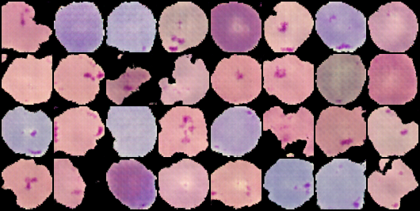
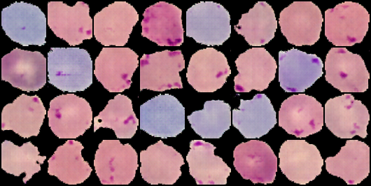
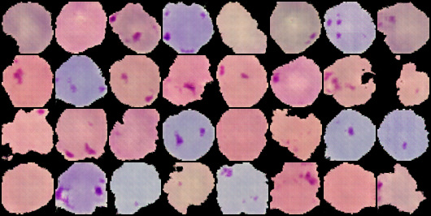
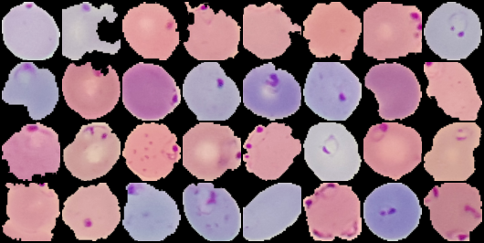

# DCGANs_Malarial_Parasite_images
Generating Malaria parasite infected RBCs

This is an effort to generate Malaria infected cell images. The source images are taken from Kaggle.Due to the scarcity of data this can be thought of as an effort to augment already available data-sets. The currently tuned parameters might work better on generating images of infected cells of other kinds as well. 

***Generated samples:*** 

***Real samples:***

